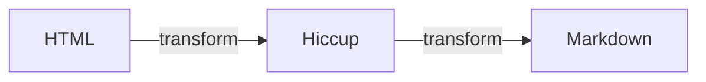

# html-to-md

A Clojure library for converting HTML into Markdown.

[](https://book.babashka.org#badges)


## Usage

```clojure
(require '[html-to-md.core :as html-to-md])

(html-to-md/convert "<h1>Some heading</h1> <p>Followed by some text</p>")
; "# Some heading\n\n Followed by some text\n\n"
```

## Development

### Test suite

Running test suite:

    clj -X:test


## Architecture

The library consist of two transformation layers:



An existing library [Hickory][1] already handles HTML to Hiccup convertion quite well,
**so this library just uses Hickory and focuses on Hiccup to Markdown convertion**.
But includes Hickory as a dependency for convenience.

To be able to generate "good looking" Markdown (without unnecessary whitespace),
content is categorizes as either "inline" or "block" content.
The [content categories are borrowed from CSS because][2] they have some conceptual overlap.
Block content use newlines to distance itself from other content.
Inline content uses space to distance itself from other content.


### Examples

Notice how irrelevant whitespace is trimmed in the following examples.

#### Example 1 - inline content

```html
<span> Some text</span><span>!</span>   <span>More</span><span> text</span>.
```

becomes:
```
Some text! More text.
```

#### Example 2 - block content

```html
<p>Some text!</p><p>More text,
across multiple lines.</p>
```

becomes:
```
Some text!

More text,
across multiple lines.
```

#### Example 3 - mixed content

```html
<p>Some <span>text!</span></p> <p>More text,
across <strong>multiple </strong>lines.</p>
```

becomes:
```
Some text!

More text,
across **multiple **lines.
```

### Technical implementation

There are two dimensions of complexity that the implementation needs to account for:
-   Prefixes related to nesting: lists within blockqoutes within lists
-   Spacing
    -   Horizontal between inline content
    -   Vertical between block content

All content that isn't block content is considered inline.
Block content:

- Paragraphs (`:p`)
- Headers (`:h1` - `:h6`)
- Lists (`:ul` & `:ol`)
- List elements (`li`)
- Blockquotes (`:blockquote`)
- Preformatted (`:pre`)
- Horizontal ruler (`:hr`)
- Tables

A few examples of inline content:

- Links (`:a`) - also known as hyperlinks or anchors.
- Emphasis (`:em`)
- Code (`:code`)
- and many more...

[1]: https://github.com/clj-commons/hickory
[2]: https://developer.mozilla.org/en-US/docs/Web/CSS/Guides/Display/Block_and_inline_layout
